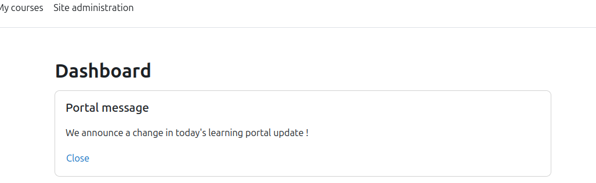
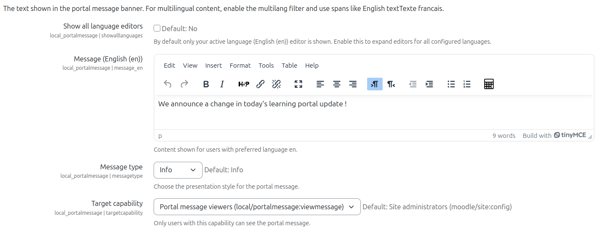

# Portal Message

Portal Message is a Moodle feature (implemented as two plugins) that lets administrators publish an announcement banner to a specific audience, and lets users dismiss it until the message changes.

It is implemented as:

- `local/portalmessage`: admin configuration, message resolution, and dismissal persistence
- `blocks/portalmessage`: the block users see, including the dismiss UI

The behaviour is specified in `openspec/specs/portal-message-*/spec.md`.

## What Users Experience

1. If you are part of the target audience (based on capability), you see a Portal Message banner on the pages where the block is placed (commonly Dashboard).
1. You can dismiss the message.
1. Once dismissed, it stays hidden for you.
1. If an admin updates the message (by increasing the message version), the message becomes visible again.

Screenshot placeholder (block on dashboard):



## Configuration Guide (Admin)

### 1. Install/enable the plugins

Both of these must be present and installed via Moodle's normal plugin installation/upgrade flow:

- `local/portalmessage`
- `blocks/portalmessage`

### 2. Configure the message

Go to `Site administration -> Plugins -> Local plugins -> Portal message` and configure:

- Enabled: turns the message on/off
- Message content: the text/HTML shown to users (supports per-language values)
- Message type: `info` or `warning`
- Target capability: only users with this capability can see the message
- Message version: increment this when you want previously dismissed messages to reappear

Screenshot placeholder (configuration form):



### 3. Place the block where users will see it

Add the **Portal message** block to the relevant context(s), for example:

- Dashboard (`my-index`)
- Site pages (system context)


### 4. Target the right audience

Portal Message visibility is capability-driven.

1. Pick a capability in the configuration.
1. Ensure the intended role(s) have that capability.
1. Assign those roles to users in the appropriate context.

Tip: The plugin provides `local/portalmessage:viewmessage` as a common, dedicated capability to target.

## Multilingual Content Notes

There are two complementary mechanisms:

1. Per-language message fields in the plugin settings (recommended for admins): the plugin stores per-language values and resolves the correct one for the current user language.
1. Moodle `multilang` filter markup (for advanced use): you can include spans such as:

```html
<span lang="en" class="multilang">English text</span>
<span lang="fr" class="multilang">Texte francais</span>
```

If you use multilang markup, enable the `multilang` filter in Moodle.

## Reference: Behaviour Summary

- Dismissal is stored as a user preference (with Privacy API support).
- Changing the message version invalidates prior dismissals.
- UI strings for this feature are provided in English, Spanish, and French.

## Developer Notes

### Quality Checks

```bash
php vendor/bin/phpcs --standard=phpcs.xml.dist public/local/portalmessage public/blocks/portalmessage
```

```bash
php vendor/bin/phpstan analyse public/local/portalmessage/classes public/blocks/portalmessage/classes --level=5
```
